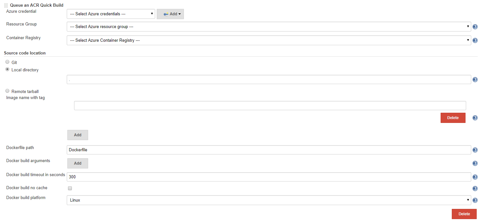

# Azure Container Registry Tasks Plugin

This plugin allows to queue an 
[Azure Container Registry Quick Task](https://docs.microsoft.com/en-us/azure/container-registry/container-registry-tasks-overview).

## Installation

This plugin is in preview release, you can download the 
[latest release](https://github.com/Azure/azure-acr-plugin/releases) hpi file.
To install the hpi file, go to your Jenkins home page, click `Manage Jenkins`|`Manage Plugins`|`Advanced`, 
upload the hpi file and restart your Jenkins server.

## Credentials
This plugin requires your Azure Credential to auth your operation.
You can refer [Azure Credential Plugin](https://wiki.jenkins.io/display/JENKINS/Azure+Credentials+plugin)
to find what kind of autherization methods are supported.

## Creating a freestyle job
Go to your Jenkins job configure page. Tap "Add build step", add "Queue an ACR Quick Task".
You will see the configuration.

* Select your Azure credential ID which you already saved to your Jenkins server.
* Select your Resource group which contains your Azure Container Registry.
* Select your Azure Container Registry name, which will be used to build and host your docker image.

* Under **`Source code location`**, you can choose `git`, `local directory` and `remote tarball` as your docker build 
  path as `docker build [PATH | URL | -]`.
    * **`Git`** - If you want to directly build a docker image from a git repo,
      choose `Git` type and enter the repository Url.
      
      The Url should use HTTP(S) protocol instead of SSH protocol. 
      If your git repo is a private one, add the PAT in the URL, *e.g. https://<github_token>@github.com/user/repo.git*.
      
      You can use **`Refspec`** to specify a branch with branch name or a pull request in format `pull/<pr number>/head`.
      Leave this field empty means the Azure Container Registry will build with default branch.
      
      **`Docker build path`** helps you set the docker build path. 
      If you want to build your docker image under a sub-directory, add the relative path to the git repo's root path.
      Leave this field empty means the Azure Container Registry will build in the git repo's root path.
    
    * **`Local directory`** - If you want to build a docker image with a local directory on your Jenkins server,
       choose `Local directory` and input the path. This plugin will upload the directory to an Azure Storage Blob
       and send the URL to Azure Container Registry.
    
    * **`Remote tarball`** - If you have already host your code as a `tar.gz` file on a web server,
       choose `Remote tarball` and send the url directly to Azure Container Registry. 
    
    > This plugin uses `Local directory` with value `.` as default.
      It will upload the code got from `Source Code Management` and processed by previous steps to Azure Storage Blob.

* After Azure Container Registry finishes docker build, it will execute docker push to push images to your registry.
  You need to specify the image name and optionally a tag under **`Image name with tag`** list
  as `docker build -t [name:tag] PATH | URL | -`.
  Leave this list empty, nothing will be pushed to your registry after docker build.

* Use **`Dockerfile path`** to specify the relative path of Dockerfile as `docker build -f [Dockerfile] PATH | URL | -`. 
  Default is `<local directory path/git repo/remote tarball>/Dockerfile`.

* Set docker build-time variables in **`Docker build arguments`** list as `docker build --build-arg [list] PATH | URL | -`

* Enable your `docker build --no-cache PATH | URL | -` flag by checking the **`Docker build no cache`**.

* You can specify the timeout option for your Azure Container Registry Build with **`Docker build timeout in seconds`**.

* You can choose your docker build agent platform from `Linux` and `Windows` with **`Docker build platform`**.

## Supporting Pipeline
This plugin also supports Pipeline project. You can use `Pipeline Syntax` to generate pipeline script.

## Contributing

This project welcomes contributions and suggestions.  Most contributions require you to agree to a
Contributor License Agreement (CLA) declaring that you have the right to, and actually do, grant us
the rights to use your contribution. For details, visit https://cla.microsoft.com.

When you submit a pull request, a CLA-bot will automatically determine whether you need to provide
a CLA and decorate the PR appropriately (e.g., label, comment). Simply follow the instructions
provided by the bot. You will only need to do this once across all repos using our CLA.

This project has adopted the [Microsoft Open Source Code of Conduct](https://opensource.microsoft.com/codeofconduct/).
For more information see the [Code of Conduct FAQ](https://opensource.microsoft.com/codeofconduct/faq/) or
contact [opencode@microsoft.com](mailto:opencode@microsoft.com) with any additional questions or comments.
